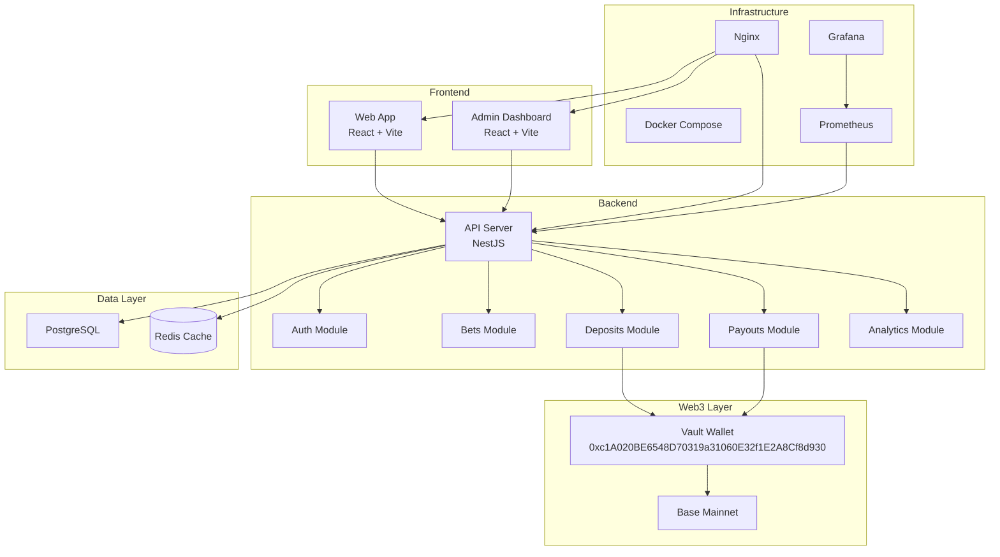

# BetTraction

> Challenge Anyone. Stake Anything. Win Everything.

[](https://github.com/bettraction/bettraction/actions/workflows/build.yml)
[](https://coveralls.io/github/bettraction/bettraction)
[](LICENSE)
[](package.json)
[](CONTRIBUTING.md)

## Project Overview

BetTraction is a production-grade Web3 platform built on Base Mainnet that enables users to create, accept, and settle peer-to-peer bets with transparent, secure, and auditable transactions. Our platform leverages a managed escrow vault system to ensure fair payouts and complete transparency.

## Features

- 🌐 **Decentralized Betting**: Create and accept bets with anyone, anywhere
- 🔒 **Secure Vault System**: Managed escrow with full audit trails
- 📊 **Transparent Transactions**: Proof of deposits and payouts publicly verifiable
- 🏆 **Leaderboards**: Compete and climb the ranks
- 📱 **Responsive Design**: Works perfectly on desktop and mobile
- ⚡ **Fast & Scalable**: Built on Base Mainnet for low fees and high throughput
- 🛡️ **Enterprise-Grade Security**: Audited and battle-tested codebase
- 📈 **Analytics Dashboard**: Track your performance and bets
- 🔔 **Real-time Notifications**: Stay updated on bet statuses

## Architecture Diagram



## Tech Stack

| Layer                | Technologies                                                      |
| -------------------- | ----------------------------------------------------------------- |
| **Frontend (Web)**   | React 18, TypeScript, Vite, Tailwind CSS, RainbowKit, Wagmi, Viem |
| **Frontend (Admin)** | React 18, TypeScript, Vite, Tailwind CSS, Recharts                |
| **Backend**          | NestJS, TypeScript, TypeORM, PostgreSQL, Redis                    |
| **Web3**             | Base Mainnet, RainbowKit, Wagmi, Viem                             |
| **DevOps**           | Docker, Docker Compose, Nginx, GitHub Actions                     |
| **Monitoring**       | Prometheus, Grafana, Sentry                                       |
| **Testing**          | Jest, React Testing Library, Playwright                           |
| **Code Quality**     | ESLint, Prettier, Husky, Commitlint, Conventional Commits         |

## Setup Guide

### Prerequisites

- Node.js 20+
- npm 10+
- Docker & Docker Compose
- PostgreSQL 15+ (optional, if not using Docker)
- Redis 7+ (optional, if not using Docker)

### Local Development

1. **Clone the repository**

   ```bash
   git clone https://github.com/bettraction/bettraction.git
   cd bettraction
   ```

2. **Install dependencies**

   ```bash
   npm install
   ```

3. **Set up environment variables**

   ```bash
   cp .env.example .env
   # Edit .env with your values
   ```

4. **Start services with Docker**

   ```bash
   docker-compose up -d postgres redis
   ```

5. **Run database migrations**

   ```bash
   cd apps/api
   npm run migration:run
   ```

6. **Start all apps**
   ```bash
   npm run dev
   ```

The apps will be available at:

- Web App: http://localhost:5173
- Admin Dashboard: http://localhost:5174
- API: http://localhost:3000

## Deployment Guide

See [Deployment Documentation](docs/deployment.md) for detailed deployment instructions.

## Environment Variables

See [Environment Variables](.env.example) for all required configuration options.

## Contributing

We welcome contributions! Please see our [Contributing Guide](docs/contributing.md) for details.

## Roadmap

See our full [Roadmap](docs/roadmap.md) for upcoming features and milestones.

### Current Phase: MVP

- ✅ Landing Page
- ✅ Wallet Connection
- ✅ Create Bet
- ✅ Accept Bet
- ✅ Deposit Flow
- ✅ Payout Flow
- ✅ Basic Analytics
- ✅ Admin Dashboard

### Upcoming Phases

- Beta: Dispute Resolution, Referral Program
- Mainnet Launch: Full Audit, Public Beta
- Leaderboards: Advanced ranking system
- Mobile App: iOS & Android
- DAO Governance: Community-driven decisions

## Security

Security is our top priority. Please see our [Security Policy](SECURITY.md) for:

- Responsible disclosure
- Security contact
- Vulnerability process
- Supported versions

### Vault System

The BetTraction Vault System uses a managed escrow model:

- **Vault Wallet**: `0xc1A020BE6548D70319a31060E32f1E2A8Cf8d930`
- All deposits are verified on-chain
- All payouts are processed with full audit trails
- Complete transparency through our Vault Transparency page

## License

This project is licensed under the MIT License - see the [LICENSE](LICENSE) file for details.

## FAQ

**Q: Is BetTraction audited?**
A: Yes, we undergo regular security audits. Audit reports are available upon request.

**Q: What network does BetTraction use?**
A: We are deployed on Base Mainnet for low fees and fast transactions.

**Q: How are deposits secured?**
A: All deposits are held in our secure vault wallet with multi-signature security and full audit trails.

**Q: Can I create my own bet terms?**
A: Yes! You can define custom bet terms, stakes, and resolution criteria.

## Support

- 📧 Email: support@bettraction.com
- 🐛 Issues: [GitHub Issues](https://github.com/bettraction/bettraction/issues)
- 📖 Documentation: [docs/](docs/)

---

<p align="center">
  <b>Built with ❤️ by the BetTraction Team</b>
</p>
